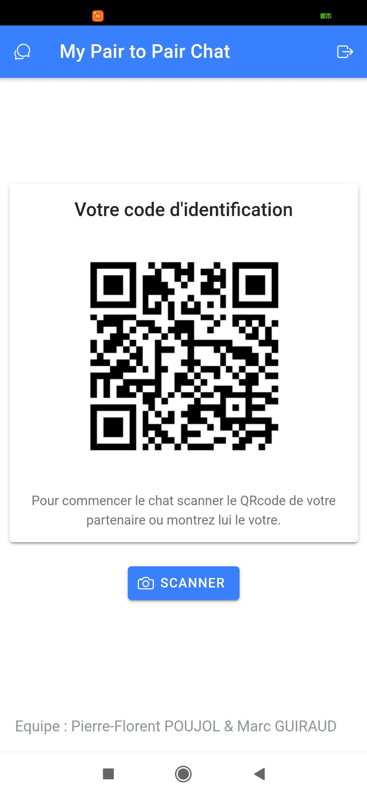
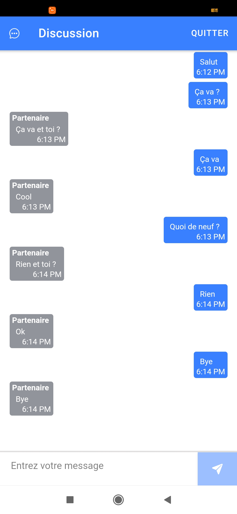

Informations générales
====
Technologie utilisé : Ionic (Angular)
Library utilisé : [PeerJS](https://peerjs.com/)
Supports visés : Android

Mise en route
====
### Executer PeerServer
Pour executer le serveur, il faut d'abord se connecter sur [Gitpod](https://gitpod.io/login/) avec le compte GitHub fourni.

Lancer le serveur : https://gitpod.io/start/#be67f35d-dfc8-49a4-973f-2fa9e7406ae1

### Installer l'apk
Lien de l'apk : https://github.com/pfpoujol/p2pIoniChat/releases/tag/1.0.0

Aperçu de l'app
=
Voir les répertoires **home** et **modal-chat** depuis [/src/app](https://github.com/pfpoujol/p2pIoniChat/tree/master/src/app).
### Screenshot
 

